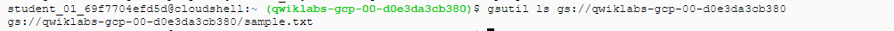

# Cloud Storage: Start-CLI/SDK
## Verify access in GCP shell

`gsutil ls gs://[YOUR_BUCKET_NAME]`

If a user has specific access to cloud storage, the Storage Object Viewer role, the output of this command looks similar to this.

## Creating a bucket

`gsutil mb -p PROJECT_ID gs://BUCKET_NAME`

## Upload an object into your bucket

`curl https://upload.wikimedia.org/wikipedia/commons/thumb/a/a4/Ada_Lovelace_portrait.jpg/800px-Ada_Lovelace_portrait.jpg --output ada.jpg`

Use the `gsutil cp` command to upload the image from the location where you saved it to the bucket you created:

`gsutil cp ada.jpg gs://YOUR-BUCKET-NAME`

## Download an object from your bucket
Use the gsutil cp command to download the image you stored in your bucket to Cloud Shell:

`gsutil cp -r gs://YOUR-BUCKET-NAME/ada.jpg .`

Don't forget to specify the output directory, which is here in this command `.`

## Copy an object to a folder in the bucket

`gsutil cp gs://YOUR-BUCKET-NAME/ada.jpg gs://YOUR-BUCKET-NAME/image-folder/`

## List contents of a bucket or folder
`gsutil ls gs://YOUR-BUCKET-NAME`

Use the `gsutil ls` command with the `-l` flag to get some details about the image file you uploaded to your bucket:

`gsutil ls -l gs://YOUR-BUCKET-NAME/ada.jpg`

## Make your object publicly accessible
Use the `gsutil acl ch` command to grant all users read permission for the object stored in your bucket:
`gsutil acl ch -u AllUsers:R gs://YOUR-BUCKET-NAME/ada.jpg`

